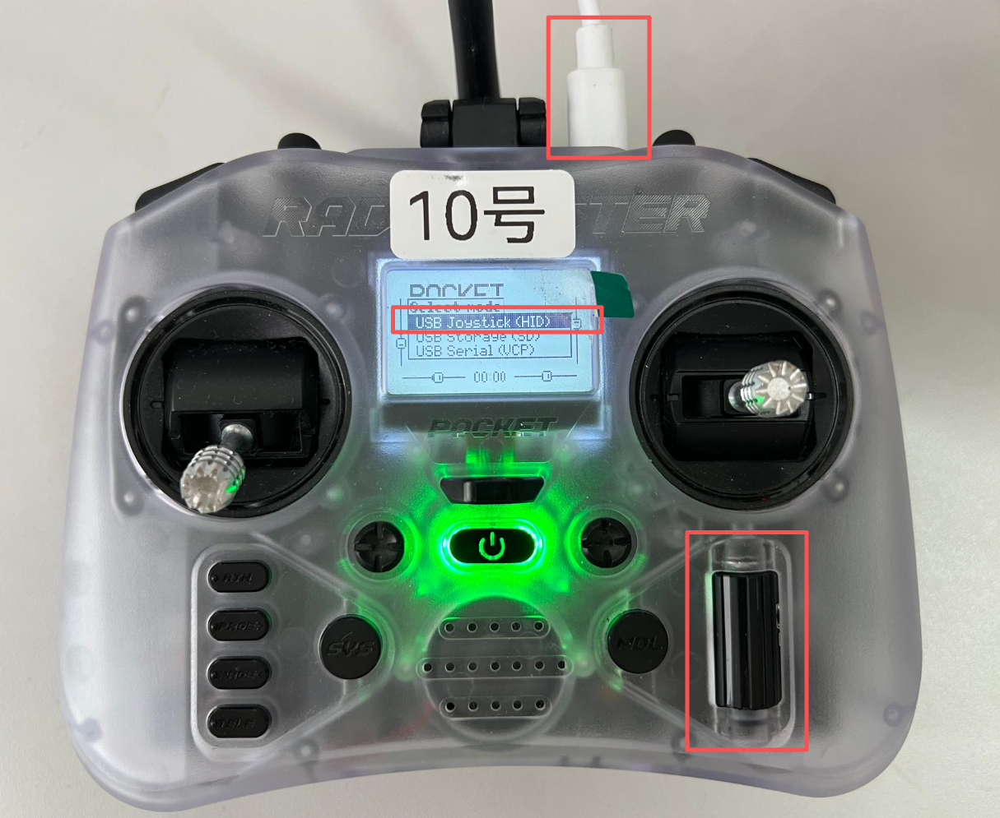

# Fast-Drone-XI35

本项目是集成了视觉/激光SLAM定位、规划、控制的无人机自动飞行完整系统

## 快速开始

### 拉取代码

``` bash
git clone git@github.com:HIT-K1928-LAB/Fast-Drone-XI35.git
```

### 编译代码

在项目主目录运行脚本

./tools/make.sh all 编译所有包
./tools/make.sh all -c 编译所有包同时生成compile_command.json,给clangd实现代码跳转

### 仿真环境飞行

初始化仿真环境模块仓库

``` bash
git submodule update --init --recursive -- \
  third_party/px4_sitl \
  src/simulation/xtdrone \
  src/simulation/gazebo_models
```

编译

``` bash
# 编译整体
bash tools/make.sh all -c

# 编译px4
cd third_party/px4_sitl/
make px4_sitl_default gazebo
```

启动总入口

``` bash
bash bringup/tmux/flight.sh pc_sim
```

在1:simulator窗口可以启动相应的仿真launch文件

``` bash
# indoor1.launch文件中的<arg name="gcs_url" value=""/>需要根据后面打开的Qground所在的ip进行修改
# 例如在仿真环境本机打开地面站，则使用
# <arg name="gcs_url" value="udp://@127.0.0.1:14550"/>
# 如果在局域网内其他设备打开地面站，则使用(192.168.31.234为例)
# <arg name="gcs_url" value="udp://@192.168.31.234:14550"/>
roslaunch px4 indoor1.launch

# 还有多种仿真环境launch可以使用，位置在third_party/px4_sitl/launch/，可以参考自己新增launch文件
```

连接radiomaster遥控器上面的type-C到电脑上，右下角滚轮滑动切换选择框，按下选择，切换radiomaster遥控器为**USB joystick**模式

电脑运行/root/code/Fast-Drone-XI35/tools/radiomaster_to_px4_rc_override.py脚本，需要修改其中的**SERVER_IP、PORT**环境变量，作用是把遥控器的杆量信息通过udp发送到服务器的mavlink上

<p align="center">
  
</p>

此时在地面站QGround上可以看到遥控器杆量信息正常，可以正常进行解锁与操控飞行

CH1:Roll
CH2:Pitch
CH3:Throttle
CH4:Yaw
CH5:供px4_ctrl包使用切换offboard模式
CH6:供px4_ctrl包使用切换offboard模式
CH7:px4的模式选择:自稳、定高、定点
CH8:emergency kill 紧急停桨

### 实机飞行

待完善

## 文档

- [Bringup 使用说明](bringup/README.md)
- [tmux唯一启动入口使用说明](bringup/tmux/README.md)
- [硬件资料](hardware/README.md)
- [Docker 使用说明](docker/README.md)


---

<details>
<summary><strong>历史 README：XI35 装机与旧版部署说明</strong></summary>

历史README.md已归档至：

[docs/archive/README-20260720.md](docs/archive/README-20260720.md)

</details>