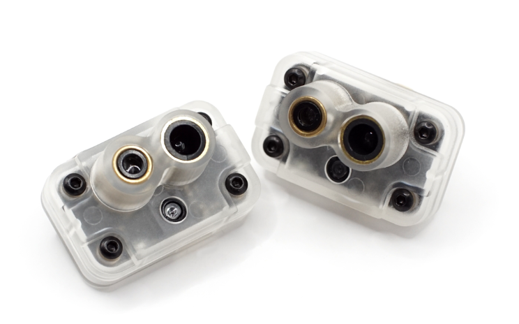
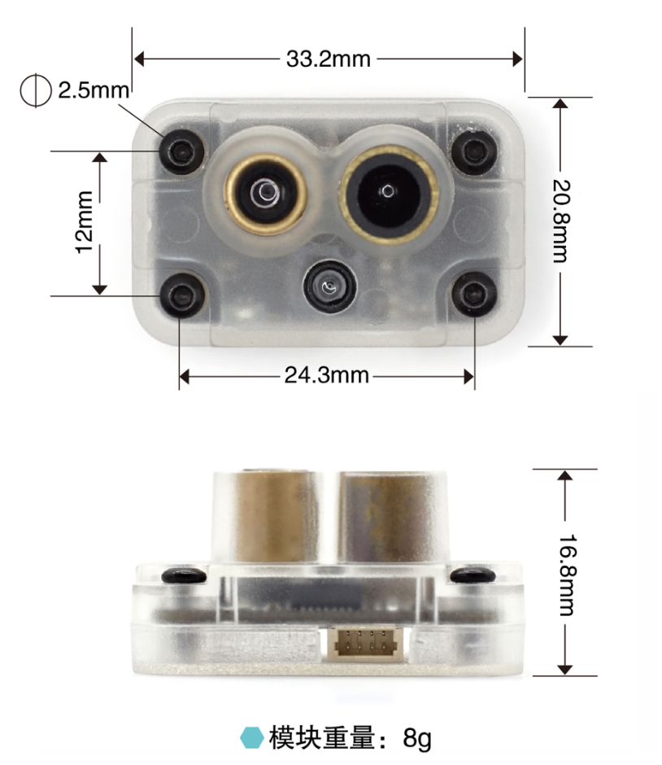
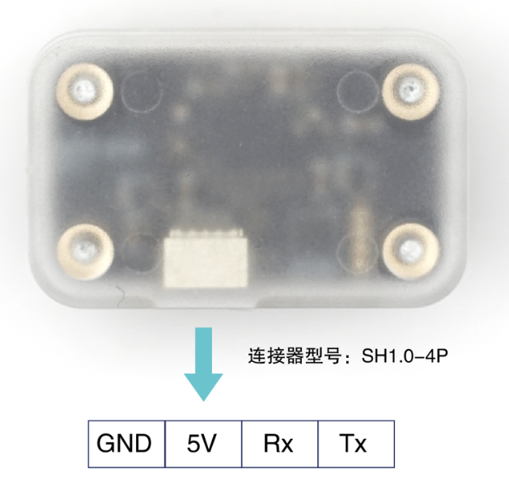

## 简介 - [源地址](https://micoair.cn/docs/MTF01P-guang-liu-ce-ju-yi-ti-chuan-gan-qi-yong-hu-shou-ce)

MTF-01P是微空科技研发设计并生产的一款光流测距一体传感器，采用串口输出数据，并内置多种通信协议，可兼容主流开源飞控：Ardupilot、PX4、INAV、FMT。只需简单配置即可适配不同飞控。

依靠MTF-01P传感器，无人机可以实现室内无GPS环境下的自主悬停飞行。

### 产品参数
- 测距范围：0.02-12m@90%反射率（600Lux）; 0.01-8m@90%反射率（70KLux）;

- 测距精度：4cm(0.02-2m@90%反射率)；2%(>2m@90%反射率)

- 测距光源：激光

- 中心波长：808nm

- 测距视场角：1.5°

- 光流视场角：42°

- 最大光流测量速度：7m/s（一米高度时）

- 光流最小工作距离：8cm

- 光流环境光需求：>60Lux

- 通信接口：LVTTL（3.3V）串口 波特率115200

- 数据频率：100Hz

- 供电电压：5V

- 平均工作电流：100mA

### 产品尺寸

- 定位孔间距：24.3 x 12mm, Φ2.5mm

- 模块尺寸：33.2 x 20.8 x 16.8mm

- 重量：8g

### 接口定义

- GND: 电源GND

- 5V：电源5V

- Rx：串口Rx，接飞控串口Tx

- Tx：串口Tx，接飞控串口Rx

### 安装方向

也可以在微空助手中调整方向参数

### 协议说明

MTF-01支持四种数据协议：

- Micolink：一种自定义协议，可以支持FMT飞控，也可以用于自主开发使用。

- Mavlink_apm: mavlink协议，支持ardupilot飞控固件

- Mavlink_px4: mavlink协议，支持PX4飞控固件

- MSP: 支持INAV飞控固件

可以使用微空助手软件切换模块协议或修改其它参数：

### 配置

配置一下参数表

- GPS_1_CONFIG = Disabled

- MAV_2_CONFIG = GPS1  

- SER_GPS1_BAUD = 115200 8N1

- MAV_2_MODE   = Normal  

- MAV_2_FORWARD = Disabled

- EKF2_OF_CTRL  = Enabled

- EKF2_RNG_CTRL = Enabled

- EKF2_HGT_REF  = Range sensor

- SENS_FLOW_ROT = No rotation

- 光流和tof数据转发到orin：MAV_2_FORWARD = Enabled

检查数据

listener sensor_optical_flow
listener distance_sensor

