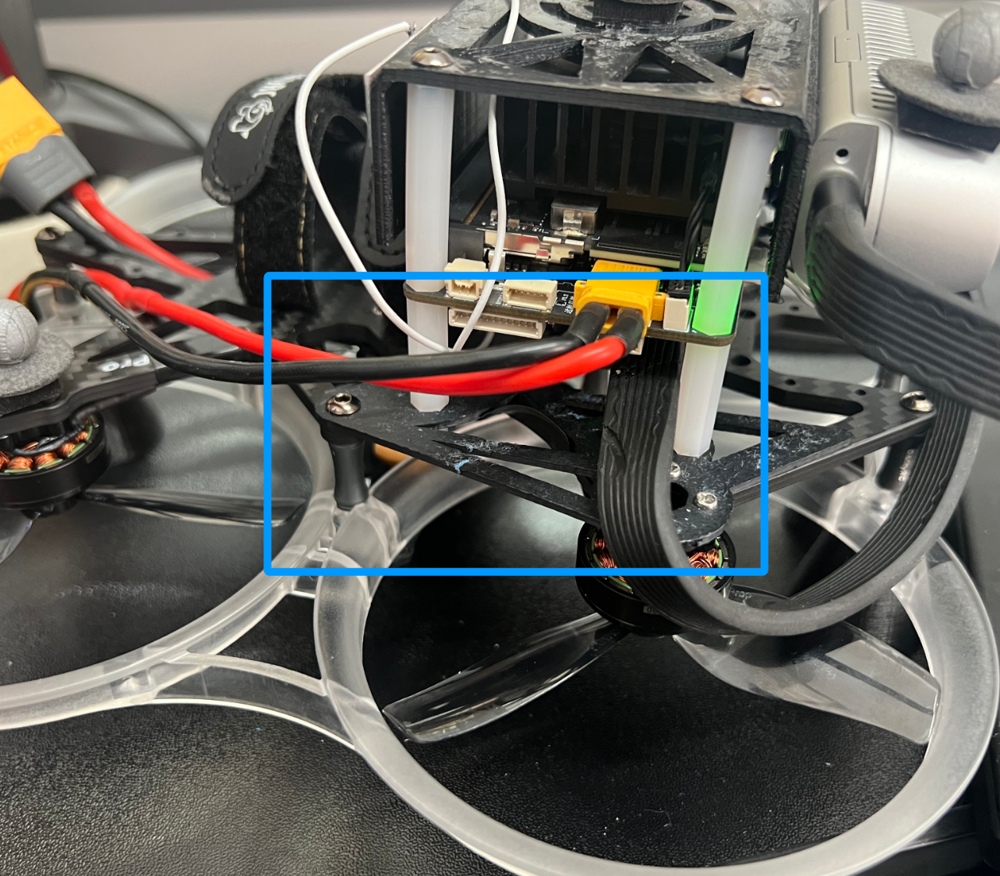
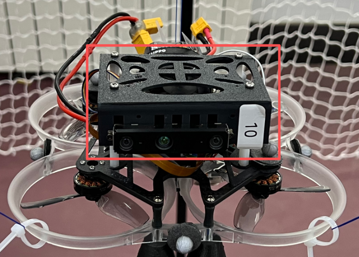
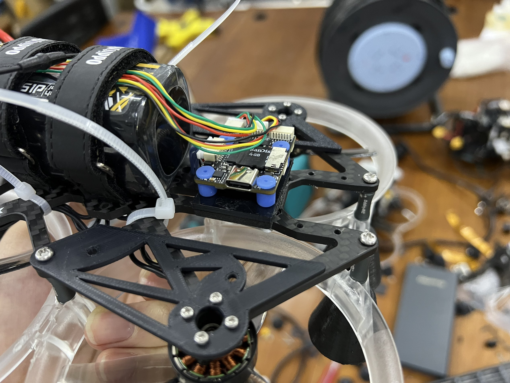
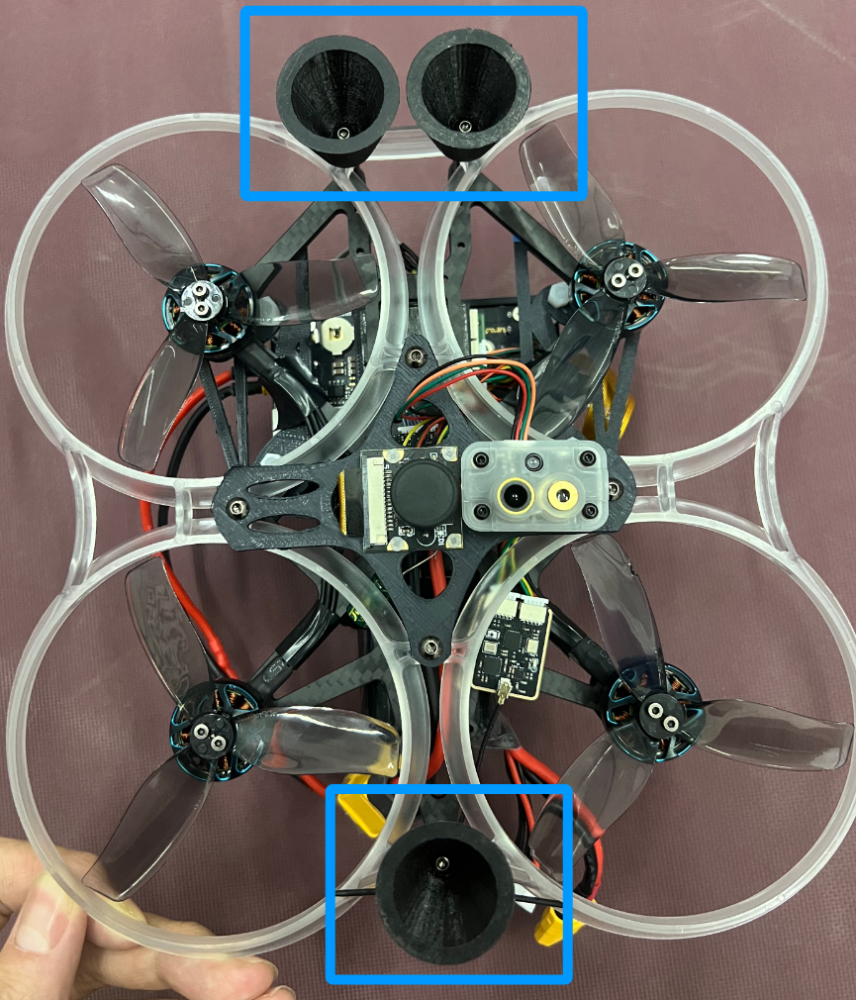

# 整体硬件架构图

# 3d-models

存放无人机组装所需要的所有额外的3d打印件

### extension_plate 无人机拓展小板

设计by 刘亦茗

### top_plate 无人机上盖板

设计by 刘亦茗

### top_plate-2 无人机上盖板v2

设计by 陈庆东

### FC_anti_vibration_bottom_plat 飞控减震底板

设计by 刘亦茗

### bottom_plate 无人机底板

设计by 陈庆东

### landing_gear 起落架

设计by 宋子一
